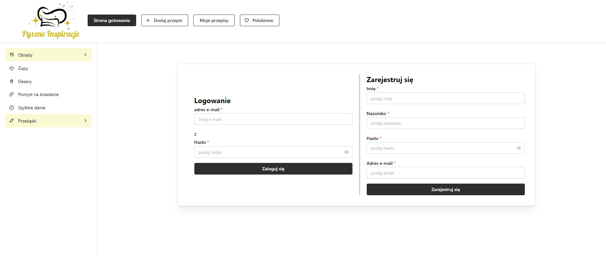
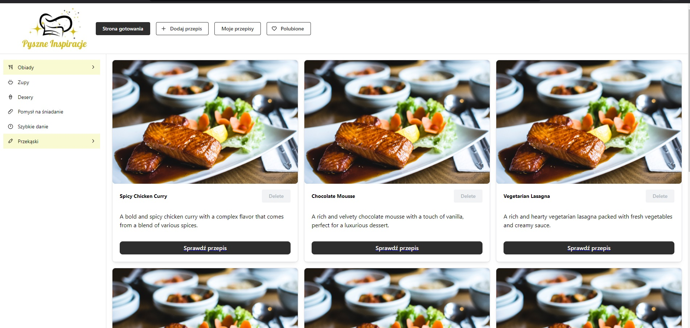
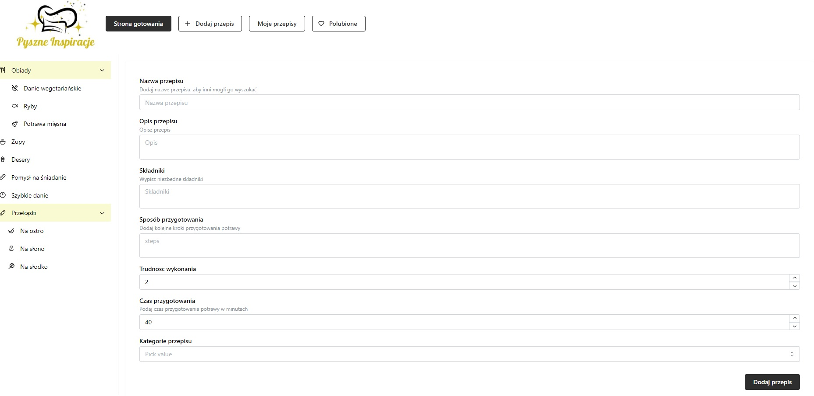

# Pyszne Inspiracje

**Pyszne Inspiracje** is a web application dedicated to cooking enthusiasts. It allows users to browse, add, rate, and comment on recipes. The app organizes recipes by categories such as main courses, soups, desserts, snacks, and more, making it easy to find culinary inspiration for any occasion.

---

## Features

1. **User Registration & Login**
    - Users can create a personal account with their email address, password, and basic profile details (first name, last name).
    - Login is required to add new recipes, comment on existing ones, or manage favorite recipes.

   
    
2. **Recipe Browsing**
    - The homepage (or “Strona gotowania”) displays a variety of recipes with images, titles, brief descriptions, and buttons to view full details.
    - Recipes are sorted into main categories such as *Obiady* (dinners), *Zupy* (soups), *Desery* (desserts), *Pomysł na śniadanie* (breakfast ideas), *Szybkie danie* (quick meals), and more.
    - Users can filter recipes by these categories to quickly find what they’re interested in.

   

3. **Add New Recipes**
    - Logged-in users can create a new recipe by providing:
        - **Recipe Name**
        - **Description**
        - **Ingredients**
        - **Steps for Preparation**
        - **Difficulty Level**
        - **Preparation Time**
        - **Category**
    - Users can upload a photo or link to an image (if supported) to make their recipe more appealing.

   

4. **Recipe Details Page**
    - Displays all information about a recipe: a detailed description, ingredients list, and step-by-step preparation instructions.
    - Shows the estimated cooking time and difficulty rating.
    - Allows users to add comments and leave their own star rating (e.g., 1–5 stars).

    

5. **Ratings and Comments**
    - Visitors can evaluate each recipe using a star-rating system.
    - Users can leave comments, share feedback (“Nice Dish,” etc.), or ask questions about the recipe.
    - The overall recipe rating is calculated based on user input.

   
6. **Favorite (Liked) Recipes**
    - Users can mark recipes as “Favorite” (Polubione) so they can quickly find them later.
    - A dedicated “Moje przepisy” section shows all the recipes a user has authored or marked.

7. **Recipe Management**
    - The recipe author (or an admin, depending on permissions) can edit or delete existing recipes.
    - Users can manage their own recipes from the “Moje przepisy” page.

---

## Main Technologies
Frontend: TypeScript, React, Mantine
Backend: NestJs
Database: sqlite, prisma
Test: Cypress

To learn React, check out the [React documentation](https://reactjs.org/).
